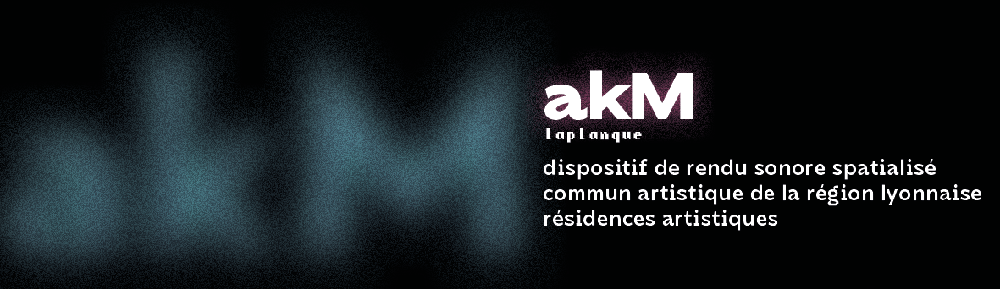

# Bienvenue sur la documentation du projet akM

!!! info
    Cette documentation est en **chantier**  et sera amenée à considérablement évoluer sur les prochains mois.

## Sur cette page dans le futur

- Brève présentation du projet
- Liens utiles vers les diverses sections de la documentation
- Mention des supports du projets (Région AURA, donnateurs HelloAsso, membres de l'association, créateurs et contributeurs au projet)
- Brève présentation du contexte dans lequel le projet est né, et présentation de .laplanque
- Brève présentation des divers projets artistiques autour de akM
- Court résumé des diverses technologies utilisées
- Il est également prévu que toute la documentation soit **traduite en anglais**.
