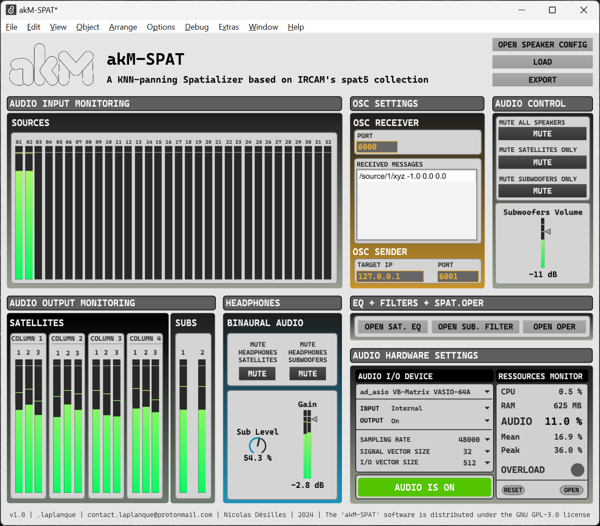

!!! info
    Le développement d'akM est actuellement **très actif**, de nouvelles mises à jours seront publiées rapidement et changeront certaines des informations actuellement disponibles dans la documentation.
    **Tous les fondements du logiciel sont cependant déjà présents**, beaucoup de processus et de techniques seront simplifiés et clarifiés dans les prochaines mises à jour (déjà prévues).
    Pensez-donc à **régulièrement consulter la documentation** lorsque vous travaillez sur akM afin de vous tenir au courant de l'évolution du logiciel.

 

## Préambule

Lire cette partie informative permet de mieux apréhender l'usage de aKM.  
**TBD** *Plus d'infos sur pourquoi il est important de lire cette partie.*

**ICI BIENTÔT UN DIAGRAMME GENERAL DU SOFTWARE**

## Les fonctionnalités du logiciel akM

Fonctionnalités déjà implémentées:

* **Rendu sonore spatialisé en temps réel** basé sur la méthode des $k$ plus proches voisins ($kNN$) (*TO-DO: Ajouter une page dans la doc sur le principe de cet algorithme*)
* Posibilité d'utiliser le **système de spatialisation *akM-SPAT*** ou bien de faire de la **diffusion multi-canaux** (utilisateurs expérimentés)
* Rendu sonore spatialisé **agnostique en terme d'équipement de diffusion audio**: il est possible de changer la configuration des enceintes (position, nombre, type) et le logiciel adapte le rendu audio
* **32 sources virtuelles disponibles** dans *akM-SPAT* pouvant être **déplacées en temps réel dans un espace 3D**
* **Réduction Binaurale au casque** de la spatialisation avec *akM-SPAT* permettant de travailler sur la spatialisation d'une oeuvre **sans avoir accès au matériel akM**
* **EQ et Filtres** dans *akM-SPAT* permettant de **calibrer la sortie audio des enceintes**
* **Contrôle en temps réel des sources virtuelles** en utilisant le puissant séquenceur d'**Ableton Live** permettant des automations complexes sur tous les paramètres exposés de *akM-SPAT*
* **Architecture de contrôle entièrement basée sur l'OSC**, permettant de futurs systèmes de contrôles non-basés sur le séquenceur d'Ableton Live
* Moteur de réverbération avancée utilisant `spat5.ircamverb~`

Futures fonctionnalités:

* **BIENTÔT:** Visualisateur 3D (*akM-PILOT*) en temps réel des sources virtuelles permettant une spatialisation intuitives des oeuvres sonores
* **BIENTÔT:** *akM-PILOT* deviendra le HUB de contrôle d'akM permettant de tout contrôler et configurer depuis une seule et même interface
* **BIENTÔT:** API de communication permettant de contrôler akM depuis d'autres logiciels (TouchDesigner, TouchOSC, Processing, etc...)
* **BIENTÔT:** Complète autonomie du système permettant une installation quasiment automatisée sans dépendance externe sur d'autres logiciels
* **BIENTÔT:** Gestion avancée des configurations physiques des enceintes
* **BIENTÔT:** Gestion avancée de la calibration, des EQ et des filtres sur les enceintes
* **BIENTÔT:** Automatisation d'un grand nombre de procédure encore manuelles qui permettrons une bien meilleure ergonomie utilisateur
  

## Outils Logiciels Utilisés et environnement (tech stack)

Le logiciel akM n'est pour l'instant utilisable que sur **Windows**.

!!! note
    Un portage vers **macOS** est **déjà prévu**. De manière générale, le développement s'était plutôt orienté vers macOS pour des raison de robustesse et de performance de sa chaine de traitement de son numérique. Cependant, au moment du développement, l'association n'avait pas accès à des machines macOS pouvant être utilisé pour les résidences et les installations, c'est pourquoi nous avons utilisé le matériel à notre disposition sous Windows. Dans une version future de la documentation, toutes les instructions d'installation et d'usage seront disponible pour **Windows** et **macOS**

**akM s'appuie sur les outils suivants:**

- [IRCAM Spat](https://forum.ircam.fr/projects/detail/spat/) : Spat est une suite d'outils de spatialisation audio en temps réel développée par l'IRCAM 
- [Max/MSP](https://cycling74.com/products/max) : Max est language de programmation visuelle, très performant pour les applications d'audio en temps réel, développé par l'IRCAM et Cycling74. La suite 'Spat' de l'IRCAM est développée dans Max.
- [VB Audio Matrix](https://vb-audio.com/Matrix/) : Cette application débloque (*enfin*) le routing audio interne performant et à grande échelle sur les systèmes Windows. Il est utilisé dans akM pour échanger les signaux audios entre les diverses applications qui composent le logiciel akM
- [openFrameworks](https://openframeworks.cc/) : openFramworks est une librairie C++ permettant de développer simplement des applications graphiques et interactives très puissantes. openFramework sera (très bientôt) utilisé pour développer toute l'interface de contrôle et de visualisation de akM
- [OSC (Open Sound Control)](https://opensoundcontrol.stanford.edu/) : L'OSC est un protocole de communication réseau basé sur l'UDP qui a été conçu pour contrôler en temps réel ordinateurs, synthétiseurs et autres systèmes audiovisuels. Toute l'architecture d'akM se base sur de la communication OSC afin d'assurerer une grande flexibilité de contrôle dans le futur.
- [Ableton Live](https://www.ableton.com/fr/live/) : Live intégrant nativement Max grâce à MaxForLive (M4L), c'est la station de travail audio numérique (DAW) évident pour ce premier développement d'akM. Il sera possible à terme de contrôler akM avec d'autres DAW et d'autres logiciels (grâce à l'OSC).
