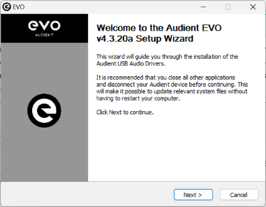
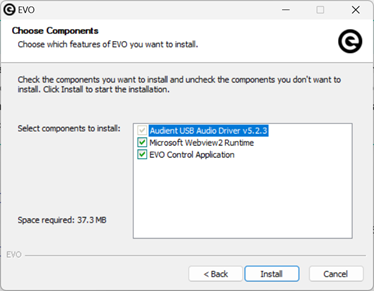
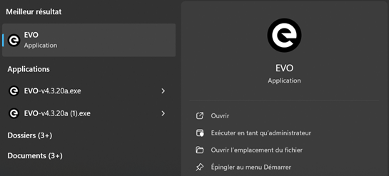
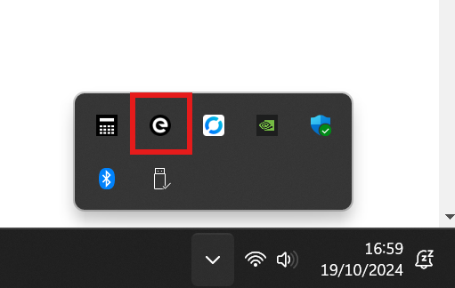
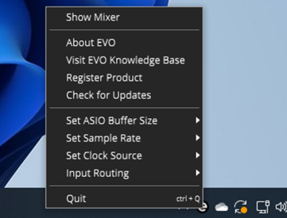
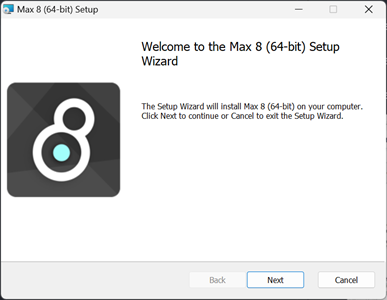
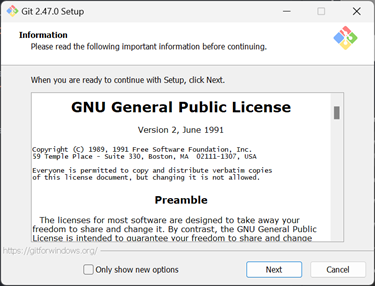
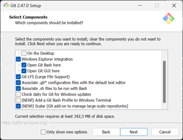
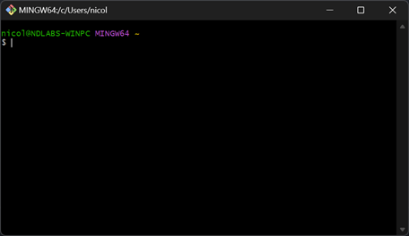
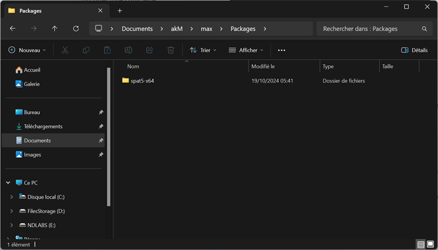

## Etape 1 : Téléchargement des divers installateurs

Commencer par télécharger les installateurs suivants:

- **Driver de l'interface audio d'akM** - Audient EVO-16 Driver for Windows - *v4.3.2 ou plus récent*:   
[LIEN VERS LE SITE](https://evo.audio/products/audio-interfaces/evo-16/downloads/) / [TÉLECHARGEMENT DIRECT](https://d9w4fhj63j193.cloudfront.net/2024/EVO%20Drivers/EVO-v4.3.20a.exe)
- **Installateur de Max 8** - Max 8 for Windows - *v8.6.5 ou plus récent*:  
[LIEN VERS LE SITE](https://cycling74.com/downloads) / [TÉLECHARGEMENT DIRECT](https://downloads.cdn.cycling74.com/max8/Max865_241008.zip)
  
    !!! tip
        **Il n'est pas nécessaire de posséder une license Max 8 pour utiliser akM**. Pour le moment, *akM-SPAT* est distribué sous la forme d'un patch Max (`.maxpat`) qui nécessite d'avoir Max 8 installé pour l'ouvrir. Il n'y a pas besoin de license pour ouvrir et utiliser le patch, seulement pour le modifier et l'enregistrer. **Bientôt, *akM-SPAT* sera distribué sous la forme d'un exécutable indépendant** ne nécessitant aucune dépendance à Max 8, éliminant ainsi le besoin de télécharger Max.

- **Installateur de VB Audio Matrix** - *v1.0.1.0 ou plus récent*:  
[LIEN VERS LE SITE](https://vb-audio.com/Matrix/) / [TÉLECHARGEMENT DIRECT](https://download.vb-audio.com/Download_Mixer/VBAudioMatrix_Setup_v1010.zip)
- **Installateur de Git** - Standalone Windows 64bit Installer - *v2.47.0 ou plus récent*:  
[LIEN VERS LE SITE](https://git-scm.com/downloads/win) / [TÉLECHARGEMENT DIRECT](https://github.com/git-for-windows/git/releases/download/v2.47.0.windows.1/Git-2.47.0-64-bit.exe)

## Etape 2 : Installation des logiciels

### Installer le Driver de l'interface audio




!!! note
    Il faut vérifier que tout soit coché dans l'installateur  

 
  

Une fois le logiciel installé, vérifié qu'il est démarré en le lançant à partir du menu démarrer Windows (chercher *EVO*), puis ouvrir la barre de statut en bas à droite de l'écran et vérifier que l'icone *EVO* apparait bien.

   
Pour ouvrir le mixeur digital, la grille de routing de la carte son et afficher toutes les autres options, il faut faire un ++"Clic Droit"++ sur l'icône *EVO* dans la barre des tâches windows et cliquer sur *Show Mixer*

!!! warning
    Cette option ne s'affichera pas dans le menu et l'interface du driver avec le mixer et les options de la carte son ne s'ouvriront pas **si la carte son n'est pas branchée à l'ordinateur**

### Installer Max 8

  

Il suffit de suivre les options par défaut.

### Installer VB Audio Matrix

  

Il n'y a qu'un seul bouton : il suffit de cliquer dessus.

!!! warning
    Il est **impératif** de **redémarrer** l'ordinateur après l'installation de VB Audio Matrix

### Installer Git


  

Au moment de la sélection des options d'installation, s'assurer que les options suivantes sont sélectionnées:

- Windows Explorer Integrations
    - Open Git Bash Here
    - Open Git GUI Here
- Git LFS (Large File Support)
- Associate .git* configuration files with the default text editor
- Associate .sh files to be run with Bash
- (NEW!) Scalar (Git add-on to manage large-scale repositories)

!!! info
    Pour toutes les autres options sur les pages suivantes de l'installateur, gardez les options par défaut, sauf si vous savez ce que vous faites.

## Etape 3 : Téléchargement d'akM

1. Ouvrir l'application *Git Bash* à partir du menu démarrer

      

2. Naviguer vers un dossier où vous souhaitez conserver les fichiers akM (par exemple `Documents`). Pour ceci, exécuter la commande `cd`:

    ```bash
    cd ~/Documents/
    ```

3. Téléchager le dépôt GitHub akM avec la commande `clone`:

    ```bash
    git clone https://github.com/contactlaplanque/akM
    ```

!!! info
    Le téléchargement représente un volume d'environ **2 Go** en raison de la suite `spat5` qui est include dans le dépôt.

## Etape 4 : Configuration de `spat5` pour Max 8

Il faut maintenant copier les fichiers de `spat5` vers le répertoire de Max 8 afin que les objets soient utilisable dans le patch Max d'akM.

Pour cela, dans l'explorateur de fichiers, naviguer dans le dossier `akM` fraichement téléchargé depuis GitHub à l'étape précédente, et copier avec ++ctrl+c++ le dossier `spat5-x64`. A partir de la racine du dossier `akM` téléchargé, le dossier à copier se trouve dans:

```bash
akM/max/Packages/
```

  

Il faut aller coller ce dossier avec ++ctrl+v++ dans:

```bash
C:/Users/[NomUtilisateur]/Documents/Max_8/Packages/
```

## Etape 5 : Configuration audio

!!! warning
    Dans le cas où vous allez travailler **sur le système d'enceintes akM** (et non juste au casque), assurez-vous à partir de maintenant que **l'ordinateur soit connecté à l'interface audio EVO-16 avec le câble USB-C, et que l'interface soit sous tension**.

!!! info
    Plus d'informations seront bientôt ajoutées pour **configurer akM pour usage au casque sans le système son**.

### Interface Audio

### VB Audio Matrix

### Windows

### Ableton
